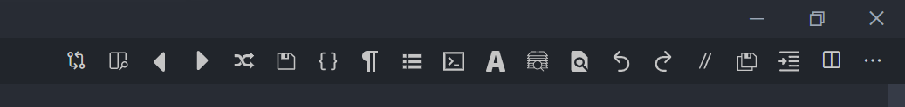
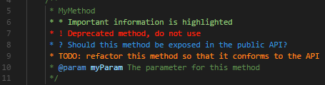
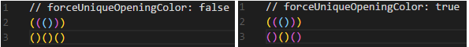
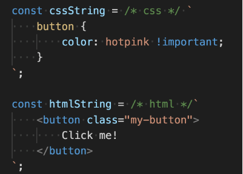
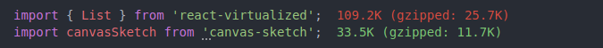
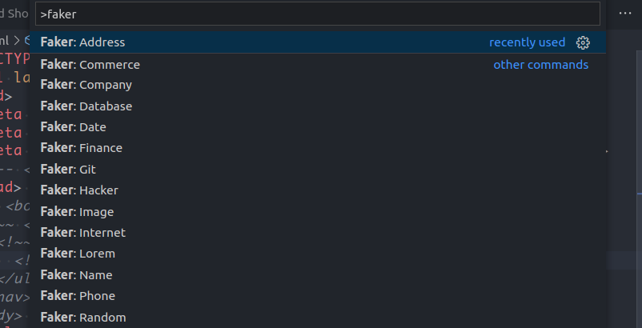

# vs-code-setup

## Contents
- [Prerequisites](#prerequisites)
- [VS Code shortcuts](#vs-code-shortcuts)
- [Extensions](#extensions)
<!--- [Ubuntu shortcuts](#ubuntu-shortcuts)
- [Windows shortcuts](#windows-shortcuts)
- [Google chrome shortcuts](#google-chrome-chortcuts)-->

## Prerequisites
- I use `vs code insiders` instead of `vs code`, but I have both of them. To open file with insider use: <br>
  `code-insiders file-name`
  - create alias to open files with `c file-name`
    ```markdown
    #Ubuntu/Window
    #inside ~/.bashrc
    alias c='code-insiders'
    ```
- I disabled `Caps Lock` key to get some additional keyboard shortcuts for VS Code and Chrome extensions
    - For ubuntu I installed [`Tweak`](https://linuxconfig.org/how-to-install-tweak-tool-on-ubuntu-20-04-lts-focal-fossa-linux)
    - To change `Caps Lock` go Tweaks / Keyboard & Mouse / Additional Layout Options / Caps Lock behavior
    - I checked `Make Caps Lock an additional Menu key`, I don't have menu key in my keyboard, it recognize in `vs code shortcuts` as `Caps Lock` but without any effect. <br><br>
    - For windows I installed [`AutoHotkey`](https://www.autohotkey.com/) [`video`](https://www.youtube.com/watch?v=lxLNtBYjkjU)
    - I have a useless button on my keybord `Pause Break` on the top-right corner that doesn't do anything when I press it;
    - I use a real button, because when i choose a non-existent button it shows `unknown` in vs code shortcuts and of course, doesn't work.
    ```ahk
    ;my config for AutoHotkey
    
    #NoEnv  ; Re`ommended for performance and compatibility with future AutoHotkey releases.
    ; #Warn  ; Enable warnings to assist with detecting common errors.
    SendMode Input  ; Recommended for new scripts due to its superior speed and reliability.
    SetWorkingDir %A_ScriptDir%  ; Ensures a consistent starting directory.

    CapsLock::Browser_Home
    return
    ```
    - So I got a lot of usefull additional shortcuts (e.g. `Caps Lock + arrows`, `Caps Lock + Shift / Win / Ctrl / Alt`)


## VS Code shortcuts
  ### settings
  - **Ctrl + comma** - open settings
  ### copy
  - **Ctrl + Shift + D** - copy line down
  - **Ctrl + Alt + P** - copy workspace path (your project's root folder) (install the [`extension`](https://github.com/malashevskyi/copy-workspace-path-vs-code-extension))
  ### change
  - **Ctrl + PageDown** - open previuos editor (previous tab)
  - **Ctrl + PageUp** - open next editor (next tab)
  ### move
  - **Ctrl + Shift + PageDown** - move editor (tab) left
  - **Ctrl + Shift + PageUp** - move editor (tab) rigth
  - **Ctrl + ArrowDown / ArrowUp** - move line up / down
  - **Shift + Alt + ArrowUp / Shift + Alt + ArrowDown** - move cursor by 7 line up / down
    ```json
      {
        "key": "shift+alt+up",
        "command": "cursorMove",
        "args": {
          "to": "up",
          "by": "line",
          "value": 7
        },
        "when": "editorTextFocus"
      },
      {
        "key": "shift+alt+down",
        "command": "cursorMove",
        "args": {
          "to": "down",
          "by": "line",
          "value": 7
        },
        "when": "editorTextFocus"
      },
    ```
  
  - **Alt + F** - separate terminal from vs code side by side with correct directory <br>
    - [`video`](https://youtu.be/x5GzCohd4eo?t=640) | [`configuration`](https://code.visualstudio.com/docs/editor/integrated-terminal#_configuration)<br>
    - **Name** - Terminal: Focus on Terminal View.
    ```json
    #Ubuntu
    "terminal.integrated.shell.linux": "/usr/bin/gnome-terminal",
    "terminal.integrated.cwd": "${cwd}",
    
    #Windows
    "terminal.integrated.shell.windows": "C:\\Program Files\\Git\\git-bash.exe",
    "terminal.integrated.cwd": "${cwd}"
    ```
    
 
## Extensions
  - [`copy-workspace-path`](https://github.com/malashevskyi/copy-workspace-path-vs-code-extension)
  - [`One Dark Pro`](https://github.com/Binaryify/OneDark-Pro) - theme
  - [`Shortcut Menu Bar`](https://github.com/GorvGoyl/Shortcut-Menu-Bar-VSCode-Extension) - additional icons
  
    ```js
      // Ctrl + Alt + 1 - run task 'start' (you have to have this task in tasks.json)
      "ShortcutMenuBar.userButton01Command": "workbench.action.tasks.runTask|npm run start",
      // Ctrl + Alt + 2 - run task 'dev' (you have to have this task in tasks.json)
      "ShortcutMenuBar.userButton02Command": "workbench.action.tasks.runTask|npm run dev",
      // Ctrl + Alt + 3 - run task 'build' (you have to have this task in tasks.json)
      "ShortcutMenuBar.userButton03Command": "workbench.action.tasks.runTask|npm run build",
      "ShortcutMenuBar.userButton05Command": "",
      "ShortcutMenuBar.userButton04Command": "",
      "ShortcutMenuBar.userButton06Command": "",
      "ShortcutMenuBar.userButton07Command": "",
      // Ctrl + Alt + 8 - keyboard shortcuts
      "ShortcutMenuBar.userButton08Command": "workbench.action.openGlobalKeybindings",
      // Ctrl + Alt + 9 - open workspace in new wideo
      "ShortcutMenuBar.userButton09Command": "workbench.action.openWorkspaceInNewWindow",
      // Ctrl + Alt + 0 - change workspace in current window
      "ShortcutMenuBar.userButton10Command": "workbench.action.openWorkspace",
      "ShortcutMenuBar.navigateBack": false,
      "ShortcutMenuBar.navigateForward": false,
      "ShortcutMenuBar.openFilesList": false,
      "ShortcutMenuBar.toggleTerminal": false,
      "ShortcutMenuBar.beautify": false,
      "explorer.openEditors.visible": 0,
    ```
  - [`Auto Rename Tag`](https://marketplace.visualstudio.com/items?itemName=formulahendry.auto-rename-tag)
  - [`Better Comments`](https://github.com/aaron-bond/better-comments)<br>
  <br>
  - [`Bookmarks`](https://github.com/alefragnani/vscode-bookmarks) - It helps you to navigate in your code, moving between important positions easily and quickly.
    - **CapsLock + DownArrow** - jump to next
    - **CapsLock + UpArrow** - jump to prev
    - **Ctrl + CapsLock  Ctrl + UpArrow** - bookmarks list from all files
    - **Ctrl + CapsLock  Ctrl + DownArrow** - bookmarks list
    - **Ctrl + CapsLock  Ctrl + T** - toggle
    - **Ctrl + CapsLock  Ctrl + L** - toggle label
  - [`Bracket Pair Colorizer 2`](https://github.com/CoenraadS/Bracket-Pair-Colorizer-2)<br>
   <br>
  - [`Code Spell Checker`](https://github.com/streetsidesoftware/vscode-spell-checker)
  - [`Color Info`](https://github.com/mattbierner/vscode-color-info)
  - [`Comment tagged templates`](https://github.com/mjbvz/vscode-comment-tagged-templates)<br>
  <br>
  - [`Clang-Format`](https://github.com/xaverh/vscode-clang-format-provider)
  - [`ES7 React/Redux/GraphQL/React-Native snippets`](https://github.com/dsznajder/vscode-es7-javascript-react-snippets)
  - [`ESLint`](https://github.com/Microsoft/vscode-eslint)
  - [`File Utils`](https://github.com/sleistner/vscode-fileutils) - easy duplicate a file or a directory
    - **CapsLock + D** - File Utils: Duplicate, 
  - [`Gist`](https://github.com/kenhowardpdx/vscode-gist)
  - [`GitLens - Git supercharged`](https://github.com/eamodio/vscode-gitlens)
  - [`Guides`](https://github.com/spywhere/vscode-guides) - visual vertical code lines
  - [`hex-to-rgba`](https://github.com/DakshMiglani/VSCode-Hex-To-RGBA)
    - **CapsLock + R** - conver hex to rgba
  - [`htmltagwrap`](https://github.com/bgashler1/vscode-htmltagwrap)
    - **Alt + W** - wrap
  - [`Image preview`](https://github.com/kisstkondoros/gutter-preview)
  - [`Import cost`](https://github.com/wix/import-cost)<br>
  <br>
  - [`Sass`](https://github.com/TheRealSyler/vscode-sass-indented)
  - [`Markdown Preview Enhanced`](https://github.com/shd101wyy/vscode-markdown-preview-enhanced)
  - [`Nest Comments`](https://github.com/philsinatra/NestedCommentsVSCode)
    - **Ctrl + /** - comment (**Ctrl + Alt + /** by default)
    ```html
    <!-- <body>
      <!~~ <nav>
        <!~~ <ul>
          <!~~ <li></li> ~~>
        </ul> ~~>
      </nav> ~~>
    </body> -->
    ```
  - [`Next.js snippets`](https://github.com/pulkitgangwar/next.js-snippets)
  - [`npm`](https://github.com/Microsoft/vscode-npm-scripts)
  - [`Path Intellisense`](https://github.com/ChristianKohler/PathIntellisense)
  - [`Prettier - Code formatter`](https://github.com/prettier/prettier-vscode)
  - [`Settings Sync`](https://github.com/shanalikhan/code-settings-sync)
  - [`Shader languages support for VS Code`](https://github.com/stef-levesque/vscode-shader)
  - [`Simple icons`](https://github.com/LaurentTreguier/vscode-simple-icons)
  - [`Tabnine Autocomplete AI: JavaScript, Python, TypeScript, PHP, Go, Java, Ruby, C/C++, HTML/CSS, C#, Rust, SQL, Bash, Kotlin, React`](https://github.com/codota/tabnine-vscode)
  - [`vscode-faker`](https://github.com/deerawan/vscode-faker)<br>
  <br>
  - [`vscode-styled-components`](https://github.com/styled-components/vscode-styled-components)


    
