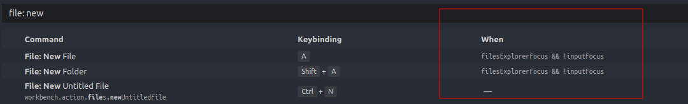

# vs-code-setup

## Contents
- [Setup](#setup)
- [VS Code shortcuts](#vs-code-shortcuts)
- [Extensions](#extensions)

## Setup
- I use `vs code insiders` instead of `vs code`, but I have both of them. To open file with insider use:
  `code-insiders file-name`
  - create alias to open files with `c file-name`
    ```js
    // Ubuntu/Window
    // inside ~/.bashrc
    alias c='code-insiders'
    ```
- I disabled `Caps Lock` key to get some additional keyboard shortcuts for VS Code and Chrome extensions
    - For Ubuntu I installed [`Tweak`](https://linuxconfig.org/how-to-install-tweak-tool-on-ubuntu-20-04-lts-focal-fossa-linux)
    - To change `Caps Lock` go Tweaks / Keyboard & Mouse / Additional Layout Options / Caps Lock behavior
    - I checked `Caps Lock is disabled`, it still recognize the key in `vs code shortcuts` as `Caps Lock` but without any effect.
    
    <br><br>
    - For windows I installed AutoHotkey [`website`](https://www.autohotkey.com/) [`video installation`](https://www.youtube.com/watch?v=lxLNtBYjkjU)
    - Here my config for AutoHotkey:
      ```ahk
      #NoEnv  ; Re`ommended for performance and compatibility with future AutoHotkey releases.
      ; #Warn  ; Enable warnings to assist with detecting common errors.
      SendMode Input  ; Recommended for new scripts due to its superior speed and reliability.
      SetWorkingDir %A_ScriptDir%  ; Ensures a consistent starting directory.

      CapsLock::Ins
      return
      ```
    - I replace `CapsLock` with `Insert` key
    - I use a real button, because when i choose a non-existent button it shows `unknown` in vs code shortcuts and of course, doesn't work.
    <br>
    - So, I use `CapsLock` in Ubuntu shortcuts and `Insert` in Windows shortcuts
     <br>
    
- Disable file filtering in sidebar and set **A** and **Shift + A** to create file and create folder
  ```js
  // settings.json
  "workbench.list.automaticKeyboardNavigation": false
  
  // keybindings.json
    {
      "key": "a",
      "command": "explorer.newFile",
      "when": "filesExplorerFocus && !inputFocus"
    },
    {
      "key": "shift+a",
      "command": "explorer.newFolder",
      "when": "filesExplorerFocus && !inputFocus"
    }
  ```
- If a shortcut doesn't work:
  - may help [`Detecting keybinding conflicts`](https://code.visualstudio.com/docs/getstarted/keybindings#_detecting-keybinding-conflicts)
  - also pay attantion on 'when' column.
    
- I use the same shortcuts for Windows and Linux with one exception - `CapsLock` and `Insert` (the difference only in naming in keyboard shortcuts, but it the same key - `CapsLock`)
- move cursor by 7 line up / down (or how much you want)
  ```json
    {
      "key": "shift+alt+up",
      "command": "cursorMove",
      "args": {
        "to": "up",
        "by": "line",
        "value": 7
      },
      "when": "editorTextFocus"
    },
    {
      "key": "shift+alt+down",
      "command": "cursorMove",
      "args": {
        "to": "down",
        "by": "line",
        "value": 7
      },
      "when": "editorTextFocus"
    },
  ```

## VS Code shortcuts
  - see [`my cheatsheet`]() - all shortcuts I use 
    
 
## Extensions
  - [`copy-workspace-path`](https://github.com/malashevskyi/copy-workspace-path-vs-code-extension)
  - [`One Dark Pro`](https://github.com/Binaryify/OneDark-Pro) - theme
  - [`Shortcut Menu Bar`](https://github.com/GorvGoyl/Shortcut-Menu-Bar-VSCode-Extension) - additional icons
  
  - [`Auto Rename Tag`](https://marketplace.visualstudio.com/items?itemName=formulahendry.auto-rename-tag)
  - [`Better Comments`](https://github.com/aaron-bond/better-comments)
  
  - [`Bookmarks`](https://github.com/alefragnani/vscode-bookmarks) - It helps you to navigate in your code, moving between important positions easily and quickly.
  - [`Bracket Pair Colorizer 2`](https://github.com/CoenraadS/Bracket-Pair-Colorizer-2)
   <br>
  - [`Code Spell Checker`](https://github.com/streetsidesoftware/vscode-spell-checker)
  - [`Color Info`](https://github.com/mattbierner/vscode-color-info)
  <br>
  - [`Comment tagged templates`](https://github.com/mjbvz/vscode-comment-tagged-templates)
  <br>
  - [`Clang-Format`](https://github.com/xaverh/vscode-clang-format-provider)
  - [`ES7 React/Redux/GraphQL/React-Native snippets`](https://github.com/dsznajder/vscode-es7-javascript-react-snippets)
  - [`ESLint`](https://github.com/Microsoft/vscode-eslint)
  - [`File Utils`](https://github.com/sleistner/vscode-fileutils) - easy duplicate a file or a directory
  - [`Gist`](https://github.com/kenhowardpdx/vscode-gist)
  - [`GitLens - Git supercharged`](https://github.com/eamodio/vscode-gitlens)
  - [`Guides`](https://github.com/spywhere/vscode-guides) - visual vertical code lines
  - [`hex-to-rgba`](https://github.com/DakshMiglani/VSCode-Hex-To-RGBA)
  - [`htmltagwrap`](https://github.com/bgashler1/vscode-htmltagwrap)
  - [`Image preview`](https://github.com/kisstkondoros/gutter-preview)
  - [`Import cost`](https://github.com/wix/import-cost)
  <br>
  - [`Sass`](https://github.com/TheRealSyler/vscode-sass-indented)
  - [`Markdown Preview Enhanced`](https://github.com/shd101wyy/vscode-markdown-preview-enhanced)
  - [`Nest Comments`](https://github.com/philsinatra/NestedCommentsVSCode)
    ```html
    <!-- <body>
      <!~~ <nav>
        <!~~ <ul>
          <!~~ <li></li> ~~>
        </ul> ~~>
      </nav> ~~>
    </body> -->
    ```
  - [`Next.js snippets`](https://github.com/pulkitgangwar/next.js-snippets)
  - [`npm`](https://github.com/Microsoft/vscode-npm-scripts)
  - [`Path Intellisense`](https://github.com/ChristianKohler/PathIntellisense)
  - [`Prettier - Code formatter`](https://github.com/prettier/prettier-vscode)
  - [`Settings Sync`](https://github.com/shanalikhan/code-settings-sync)
  - [`Shader languages support for VS Code`](https://github.com/stef-levesque/vscode-shader)
  - [`Simple icons`](https://github.com/LaurentTreguier/vscode-simple-icons)
  - [`Tabnine Autocomplete AI: JavaScript, Python, TypeScript, PHP, Go, Java, Ruby, C/C++, HTML/CSS, C#, Rust, SQL, Bash, Kotlin, React`](https://github.com/codota/tabnine-vscode)
  - [`vscode-faker`](https://github.com/deerawan/vscode-faker)
  <br>
  - [`vscode-styled-components`](https://github.com/styled-components/vscode-styled-components)
  - [`DotENV`](https://github.com/mikestead/vscode-dotenv)
  - [`Highlight Matching Tag`](https://github.com/vincaslt/vscode-highlight-matching-tag)
  - [`Log File Highlighter`](https://github.com/emilast/vscode-logfile-highlighter)
  - [`vscode-live-server`](https://github.com/ritwickdey/vscode-live-server)


    
